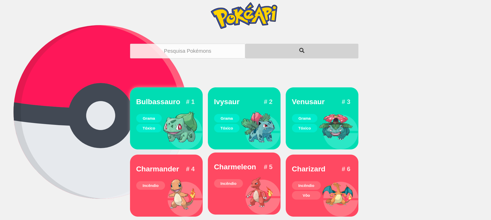

<h1 align="center">
  
</h1>

<p align="center">
  
</p>


🚀 Tecnologias;

- React
- TypeScript
- Styled Components
- Axios
- PokéAPI


🏃 Para rodar o projeto na sua máquina;

```bash
git clone https://github.com/tmz81/Pok-API.git

npm install

npm run dev
```